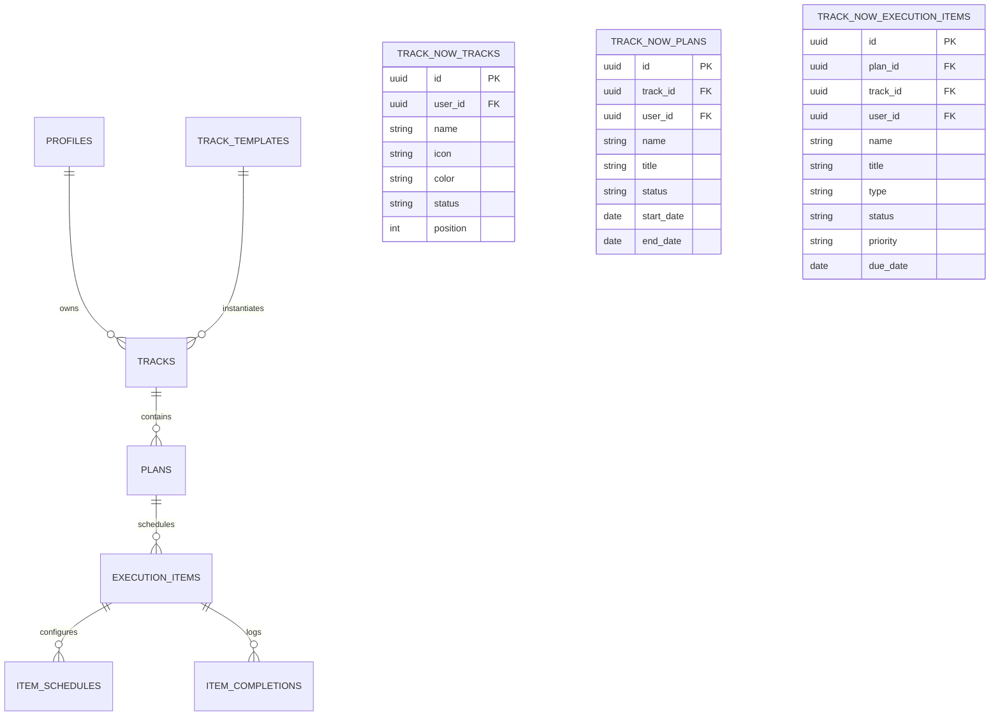

# Track.now — Architecture & System Design

This document details the architectural principles, module boundaries, data flows, and design decisions governing **Track.now**.

---

## 1. Architectural Philosophy: The Modular Monolith

Track.now intentionally avoids microservice fragmentation, multi-repo overhead, and complex intermediary proxy servers. It is structured as a **modular monolithic client application backed directly by a serverless relational data engine (Supabase/PostgreSQL)**.

### Core Architectural Decisions
1. **Direct-to-Postgres Security Model:** Authentication, access control, and tenant isolation are enforced at the database layer via **PostgreSQL Row Level Security (RLS)**. No Node.js/Express middleware is required to authorize reads or writes.
2. **Deterministic Domain Layer:** Business calculations (progress rollups, completion metrics, scheduling classifications) are implemented as pure, side-effect-free TypeScript functions located in `src/domain/`.
3. **Repository/Service Separation:** Components never construct ad-hoc Supabase queries. All database operations are channeled through strongly typed services in `src/services/`.
4. **Tokenized Design System:** All UI components rely exclusively on semantic design tokens (`src/styles/tokens.css`), eliminating arbitrary inline styling and making dark/light theme switching zero-friction.

---

## 2. Layered Architecture Diagram

```
┌─────────────────────────────────────────────────────────────────┐
│                          PRESENTATION LAYER                     │
│  Pages (`src/pages/*`)  │  Components (`src/components/*`)      │
└────────────────┬────────────────────────────────┬───────────────┘
                 │                                │
                 ▼                                ▼
┌────────────────────────────────┐   ┌────────────────────────────┐
│      APPLICATION & HOOKS       │   │       DOMAIN LAYER         │
│  - AuthProvider & useAuth      │   │  - progress.ts             │
│  - useTheme & UI Hooks         │   │  - dates.ts                │
│  - Page Route Guards           │   │  - types/domain.ts         │
└────────────────┬───────────────┘   └────────────▲───────────────┘
                 │                                │ (Pure Types & Math)
                 ▼                                │
┌─────────────────────────────────────────────────┴───────────────┐
│                     SERVICE / REPOSITORY LAYER                  │
│  - tracksService.ts   │  - plansService.ts                      │
│  - executionService.ts│  - authService.ts                       │
└────────────────────────────────┬────────────────────────────────┘
                                 │
                                 ▼
┌─────────────────────────────────────────────────────────────────┐
│                     INFRASTRUCTURE / CLIENT                     │
│  - lib/supabase/client.ts (Supabase JS SDK)                     │
└────────────────────────────────┬────────────────────────────────┘
                                 │ HTTPS / WebSockets
                                 ▼
┌─────────────────────────────────────────────────────────────────┐
│                      SUPABASE BACKEND (PostgreSQL)              │
│  - Auth Engine (GoTrue)  │  - Row Level Security (RLS)          │
│  - Schema Tables         │  - Realtime Change Notifications     │
└─────────────────────────────────────────────────────────────────┘
```

---

## 3. Layer Responsibilities & Strict Boundaries

### Layer 1: Presentation (`src/pages`, `src/components`)
- **Responsibilities:**
  - Renders UI state, handles user interactions, manages local form input states.
  - Consumes services and domain functions; handles loading and error states with reusable primitives (`<LoadingState />`, `<ErrorState />`, `<EmptyState />`).
- **Strict Rule:** Presentation components **MUST NOT** import `supabase` directly. They must always use the service methods in `src/services/` or hooks in `src/features/`.

### Layer 2: Domain Layer (`src/domain`)
- **Responsibilities:**
  - Pure algorithmic calculations: progress percentages, plan rollups, track status aggregations, due date classification (overdue, today, upcoming).
  - Contains zero I/O, zero network calls, zero DOM mutations, and zero Supabase dependencies.
- **Strict Rule:** Domain functions must remain 100% deterministic and unit-testable without mocking network or browser APIs.

### Layer 3: Service / Repository Layer (`src/services`)
- **Responsibilities:**
  - Encapsulates database queries, mutations, sanitization, and error translations.
  - Transforms raw database rows into domain TypeScript interfaces (`src/types/domain.ts`).
  - Implements atomic operations (e.g. creating an item completion record and updating the item status in a single transaction or paired call).

### Layer 4: Infrastructure (`src/lib/supabase`)
- **Responsibilities:**
  - Initializes the single `@supabase/supabase-js` client instance.
  - Validates environment variables (`isSupabaseConfigured()`) and guards against runtime crashes when API keys have not been configured yet.

---

## 4. Domain Data Model & Invariants



### Invariants & Business Rules
1. **Duplicate Tracks Allowed:**
   If a user creates a track with a name that already exists (e.g., a second "Fitness" track for a distinct athletic endeavor), the system **does not block them**. A confirmation dialog politely prompts them:
   > *"You already have a [Name] Track. Would you like to use your existing Track or create another one?"*
   Choosing to continue creates a distinct new track with its own UUID.

2. **Progress Calculations Never Faked:**
   Track and Plan progress is calculated purely:
   $$\text{Progress \%} = \text{round}\left(\frac{\sum \text{items with status 'done'}}{\sum \text{active non-archived items}} \times 100\right)$$
   - If there are 0 items in an active plan, progress is strictly $0\%$.
   - Archived items and archived plans are excluded from active track progress rollups.

3. **Status Transitions:**
   - Tasks / Habits / Checklists toggle between `'todo'` and `'done'`.
   - Projects and Milestones can transition through `'todo' -> 'in_progress' -> 'done'`.
   - Archival is non-destructive: archiving a Track or Plan sets `status = 'archived'`. All children remain intact and can be restored at any time.

---

## 5. Security & Multi-Tenancy Architecture

### Row Level Security (RLS)
Track.now relies on PostgreSQL RLS policies where every table with user data has:
```sql
ALTER TABLE <table> ENABLE ROW LEVEL SECURITY;

CREATE POLICY "Users can only manage their own data"
  ON <table>
  FOR ALL
  USING (auth.uid() = user_id)
  WITH CHECK (auth.uid() = user_id);
```
Even if a compromised or malicious client crafts an arbitrary Supabase API query with another user's UUID, PostgreSQL immediately rejects the request with an empty set or error.

### Authentication Flow
1. User submits email/password to `supabase.auth.signUp()` or `supabase.auth.signInWithPassword()`.
2. Supabase issues JWT access and refresh tokens stored securely in local browser storage via the Supabase client.
3. The database trigger `on_auth_user_created_track_now` automatically inserts a corresponding row in `public.track_now_profiles`.
4. `AuthProvider` listens to `supabase.auth.onAuthStateChange` to synchronize session state into React context without page reload.

---

## 6. Offline Readiness & PWA Structure

- **Static Asset Caching:** Vite compiles production assets into fingerprinted chunks with CSS/JS hash filenames.
- **Manifest:** `public/manifest.webmanifest` provides PWA metadata, color definitions, and standalone display configurations.
- **Responsive Layout:** `AppShell` automatically switches between a persistent desktop sidebar navigation and an accessible bottom navigation bar on mobile viewports ($\le 768\text{px}$).
